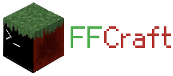
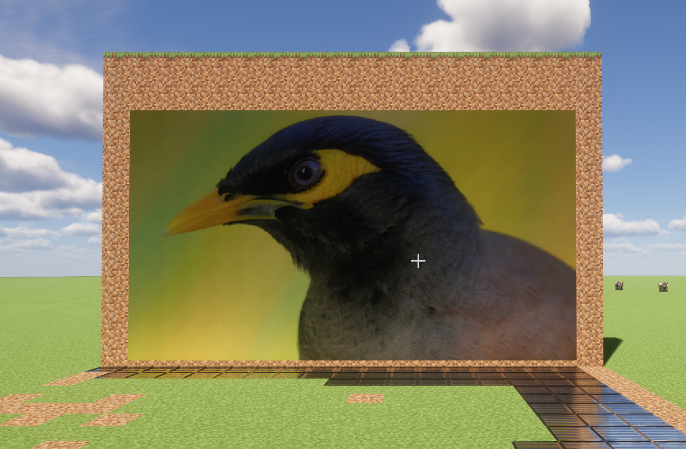
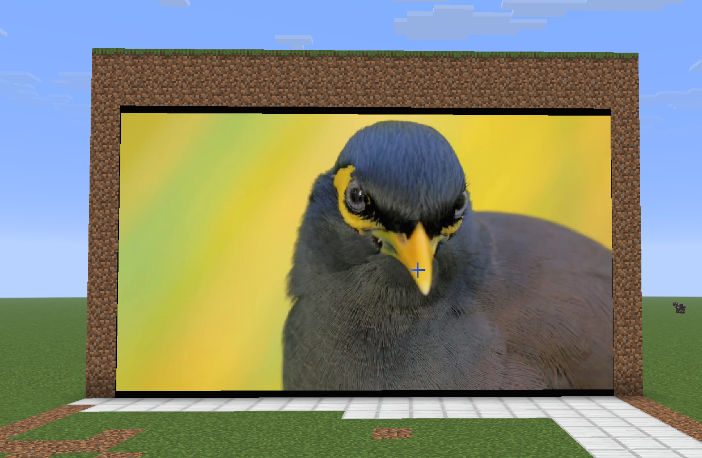

# FFCraft



> 一个强大的 Minecraft Java 版媒体播放模组，让您在世界中播放任意媒体内容，支持自定义形状屏幕并完美兼容光影。

## ✨ 功能特性

- **全格式媒体播放** — 基于 FFmpeg，支持几乎所有音频与视频格式
- **任意形状屏幕** — 通过放置顶点构建多边形显示区域，最多支持 64 个顶点
- **光影完美兼容** — 屏幕可正确反射和响应光影包的光照效果，显示自然
- **便捷 GUI 管理** — 默认按 `G` 键打开图形界面，轻松创建、配置、删除播放器
- **完善命令系统** — 提供全套指令，便于管理员和玩家交互
- **高性能解码** — 保障高分辨率视频流畅播放

## 🛠 技术栈与前置

- **模组框架**：Fabric
- **语言**：Java
- **媒体引擎**：FFmpeg
- **前置模组**：**ImGui** (必须安装)

## 演示截图

> 以下为 FFCraft 在游戏中的实际效果展示：




## 📥 安装

### 普通玩家

1. 确保已安装 **Fabric Loader** 和 **Fabric API**
2. 安装前置模组 **ImGui**
3. 前往 [Releases 页面](https://github.com/Sashwind888/FFCraft/releases)
4. 下载对应游戏版本的最新构建 `.jar` 文件
5. 放入 Minecraft 的 `mods` 文件夹
6. 启动游戏

### 开发者

```bash
git clone https://github.com/Sashwind888/FFCraft.git
cd FFCraft
./gradlew build
```

构建产物位于 `build/libs/`。

### 特殊指令集玩家

1. 克隆仓库后，编辑 `build.gradle`
2. 添加适配您平台架构的 FFmpeg 依赖
3. 运行：
   ```bash
   ./gradlew jar
   ```

## 🚀 快速开始

1. 进入游戏后，按下 **G** 键打开 FFCraft 管理 GUI
2. 在 GUI 中点击“创建播放器”，然后点击“创建屏幕”
3. **右键** 放置屏幕的各个顶点（最多 64 个），**左键** 取消上一个顶点，**点击起始点** 完成多边形创建
4. 为播放器指定一个名称，并选择公开/私有状态
5. 在播放器界面加载媒体文件或输入流地址，即可开始播放

## 📋 命令系统

| 命令 | 权限 | 说明 |
|------|------|------|
| `/ffcraft create <name> [public\|private]` | Admin | 创建播放器 |
| `/ffcraft list` | 所有人 | 列出所有播放器 |
| `/ffcraft info <uuid>` | 所有人 | 查看播放器详情 |
| `/ffcraft rename <uuid> <newName>` | Edit | 重命名 |
| `/ffcraft delete <uuid>` | Admin | 删除播放器 |
| `/ffcraft setpublic <uuid> <true\|false>` | Admin | 设置公开状态 |
| `/ffcraft reload` | Admin | 重新同步所有客户端 |

- 权限节点：`ffcraft.admin`、`ffcraft.edit` 等（根据服务器权限插件配置）
- 所有 `uuid` 参数均指播放器的唯一标识

## 🤝 贡献

欢迎提交 Issue 和 Pull Request 来改进 FFCraft！

## 📄 许可证

本项目采用 **AGPLv3** 许可证。您可以自由使用、修改和分发，但修改后的项目也必须以相同许可证开源。详情请查看 [LICENSE](LICENSE) 文件。

---

*希望这个项目可以帮到你喵~ --sashwind*
*插件版：[github](https://github.com/Sashwind888/FFCraftPlg)*
```
